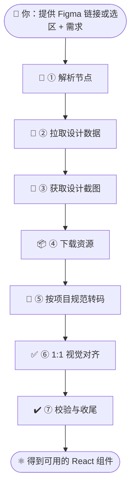

# implement-design — 设计稿转代码 Skill

将 Figma 设计稿转化为可上线代码，支持 1:1 视觉还原。当你提供 Figma 链接、说「实现设计」「根据设计稿生成代码」或需要按 Figma 规范实现组件时，AI 会按本 Skill 的流程，配合 Figma MCP 完成从设计到 Ant Design React 组件的实现。

## 支持的功能

| 功能 | 说明 |
|------|------|
| 🎨 **设计稿转代码** | 从 Figma 设计稿生成可上线的 React 代码，支持 1:1 视觉还原 |
| 🔗 **Figma 链接解析** | 支持带 `node-id` 的 Figma URL，自动解析 fileKey 与节点 ID |
| 🖱️ **Figma Desktop 选区** | 使用桌面端 MCP 时，可直接选中画板/节点，无需粘贴链接 |
| 📐 **设计数据拉取** | 通过 MCP 获取布局、字体、颜色、间距等结构化设计数据 |
| 📸 **设计截图参考** | 获取设计稿截图作为视觉标准，实现与验收均以此为准 |
| 📦 **资源自动下载** | 按设计数据下载图片、图标、SVG，使用 MCP 资源地址，不引入额外 icon 包 |
| 🧩 **设计系统映射** | 优先 Code Connect → reference 映射 → 项目组件库（如 Ant Design） |
| ✅ **1:1 视觉校验** | 对照截图校验布局、字体、颜色、交互状态，确保与设计一致 |
| ♿ **无障碍与文档** | 遵循 WCAG，必要时在代码中补充注释说明偏差原因 |

---

## 适用场景

| 场景 | 说明 |
|------|------|
| 📝 **按设计稿写代码** | 有 Figma 链接或已在 Figma 里选中节点，希望生成与设计一致的 React 组件 |
| 🧩 **设计系统落地** | 需要把设计稿映射到项目既有设计系统或 Ant Design，而不是从零手写样式 |
| 👁️ **视觉校验** | 希望产出与设计截图严格一致，减少反复改稿 |

**典型说法示例**：  
「实现这个设计」「根据这个 Figma 链接生成代码」「把这个按钮/卡片/页面按设计稿实现一下」。

---

## 如何使用

#### 前置条件

- Skill 依赖 **Figma MCP 服务** 获取设计数据与截图，使用前需确保已连接且可用。
- **若 MCP 不可用**，Skill会自动配置Figma MCP Server：
  - **桌面版（推荐，无需 OAuth）**：  
    `[http://127.0.0.1:3845/mcp](http://127.0.0.1:3845/mcp)`
  - **Remote OAuth 版**：  
    `[https://mcp.figma.com/mcp](https://mcp.figma.com/mcp)`
- 自动添加Figma MCP Server后，需 **重启 Cursor** 再继续使用，建议在使用Skill前先添加Figma MCP Server。具体参考[Figma MCP文档](https://developers.figma.com/docs/figma-mcp-server/remote-server-installation/)

#### Cursor 配置

拷贝 Skill 到 `.cursor/skills` 目录即可。目录结构与 `implement-design` 一致：

```
implement-design/
├── SKILL.md              # 流程说明与实现规则
├── reference/             # 组件参考与映射
│   └── antd.csv
├── scripts/               # 可执行脚本
│   └── setup-figma-mcp.js
├── docs/                  # 文档
│   └── FIGMA_MCP_TROUBLESHOOTING.md
└── .env                   # 环境变量（可选，勿提交敏感内容）
```

---

## Skill 工作流

你只需提供 **Figma 链接或选区 + 一句需求**，其余由 AI 按 Skill 步骤执行。

### 工作流一览



### 各步骤说明

|         步骤         | 说明                                                                                                                                                         |
| :------------------: | ------------------------------------------------------------------------------------------------------------------------------------------------------------ |
|    **① 解析节点**    | AI 从 URL 中解析 `fileKey`、`node-id`，或从 Figma Desktop 当前选区获取节点。                                                                                 |
|  **② 拉取设计数据**  | 调用 `get_design_context` 获取布局、字体、颜色、间距等结构化数据。                                                                                           |
|  **③ 获取设计截图**  | 调用 `get_screenshot` 得到设计稿截图，作为后续实现的**视觉标准**。                                                                                           |
|    **④ 下载资源**    | 按设计数据下载图片、图标、SVG 等资源（使用 MCP 提供的资源地址，不引入额外 icon 包）。                                                                        |
| **⑤ 按项目规范转码** | 将设计数据转为项目技术栈（如 React + 项目设计 token），优先使用 Code Connect 映射、`reference/` 映射（如 `antd.csv`）、项目已安装的组件库（如 Ant Design）。 |
|  **⑥ 1:1 视觉对齐**  | 以步骤 ③ 的截图为准，调整布局、间距、字体、颜色，直到与设计一致。                                                                                            |
|   **⑦ 校验与收尾**   | 对照截图做最终校验（布局、字体、颜色、交互状态、无障碍等），并做必要注释或文档。                                                                             |

你不需要自己执行 MCP 调用或脚本，只要**说清需求 + 提供链接或选区**即可。

---

## 你会得到什么（产物）

| 产物 | 说明 |
|------|------|
| ⚛️ **可用的 React 组件** | 与设计稿 1:1 对应的 UI 组件，符合项目目录与命名规范 |
| 🧩 **设计系统集成** | 尽量复用现有 Button、Input、Typography 等，并映射到设计 token |
| 📦 **资源就位** | 图片/图标等使用 MCP 提供的资源，不新增无关依赖 |
| 📸 **可追溯的视觉标准** | 实现过程以设计截图为唯一视觉依据，便于验收与迭代 |

若有偏差（如因无障碍或技术限制），AI 会在代码注释中说明原因。


